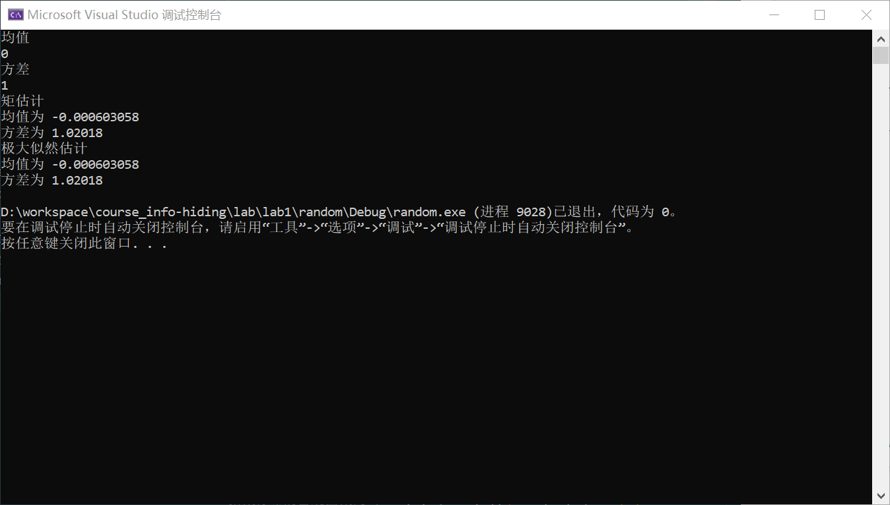
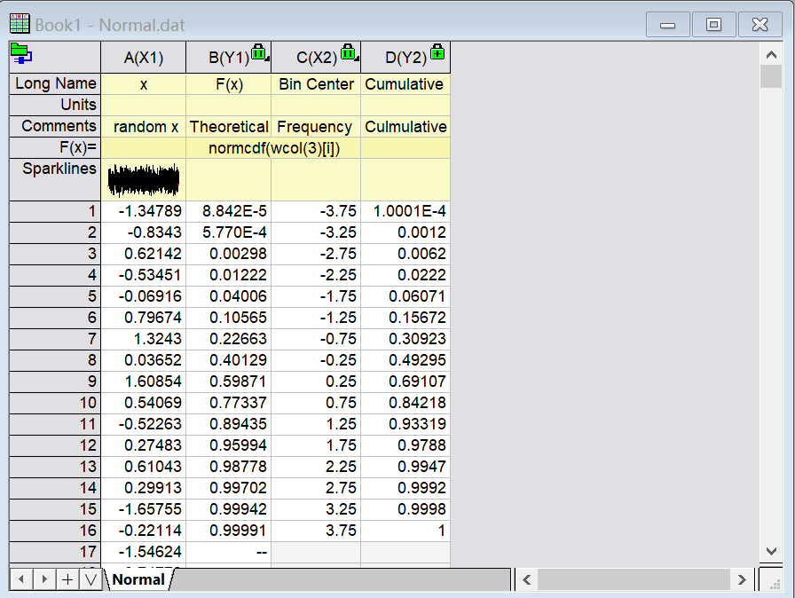
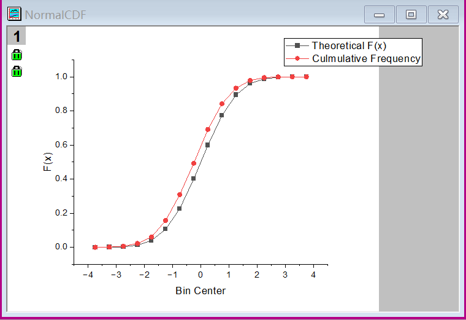
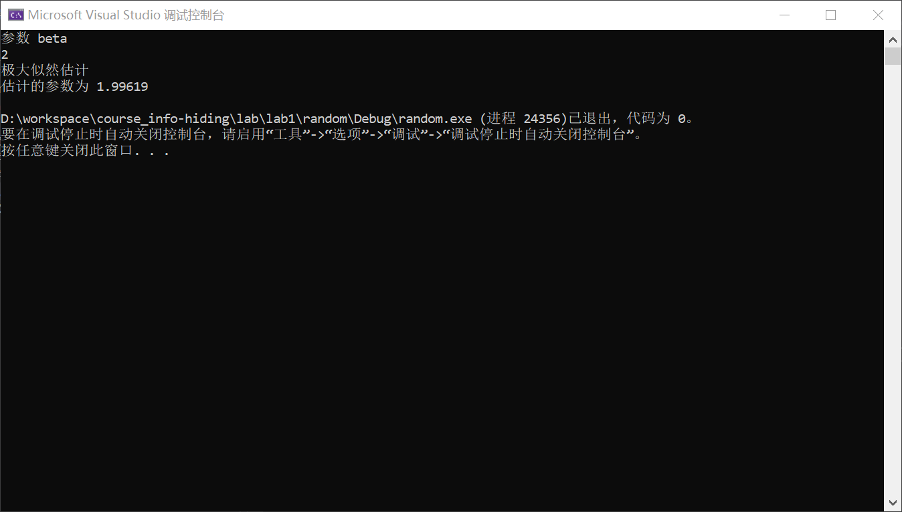
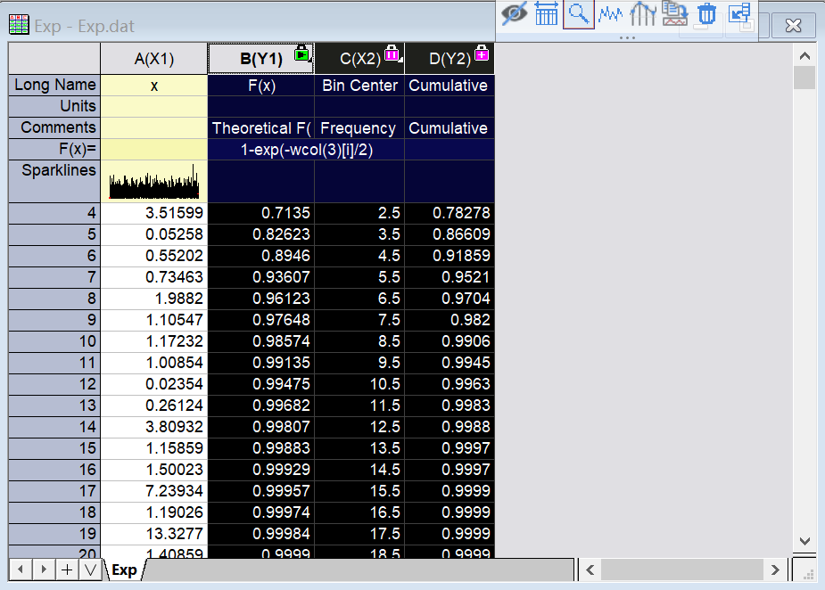
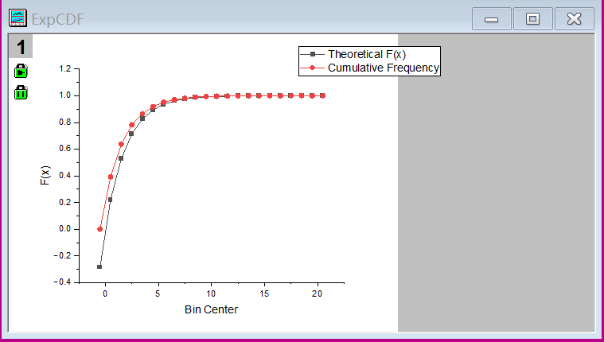

# 实验一：随机数生成器

- [实验一：随机数生成器](#实验一随机数生成器)
  - [实验要求](#实验要求)
  - [实验环境](#实验环境)
  - [产生服从 $Uniform(0,1)$ 分布](#产生服从-uniform01-分布)
    - [c++生成随机数的机制](#c生成随机数的机制)
    - [代码实现](#代码实现)
  - [产生服从高斯分布 $N(\\mu,\\delta^2)$ 的随机数](#产生服从高斯分布-nmudelta2-的随机数)
    - [Box-Muller transform](#box-muller-transform)
    - [代码实现](#代码实现-1)
    - [参数估计](#参数估计)
    - [CDF 比较](#cdf-比较)
  - [产生服从指数分布 $Exp(\\frac{1}{\\beta})$ 的随机数](#产生服从指数分布-expfrac1beta-的随机数)
    - [逆函数法构造指数分布](#逆函数法构造指数分布)
    - [代码实现](#代码实现-2)
    - [参数估计](#参数估计-1)
    - [CDF 比较](#cdf-比较-1)
  - [产生服从服从 $GDD$ 分布的随机数](#产生服从服从-gdd-分布的随机数)
    - [构造 $GGD$ 分布的一种方法](#构造-ggd-分布的一种方法)
    - [特殊情形的 $GGD$ 分布](#特殊情形的-ggd-分布)
    - [矩估计](#矩估计)
  - [参考文献](#参考文献)

## 实验要求

1. 产生符合高斯分布 $N(\mu,\delta^2)$ 的随机数，然后用参数估计法估计相应的 $\mu,\delta$. 最后对比理论和实际的 CDF
2. 利用逆函数法根据 $[0,1]$ 的均匀分布来产生尺度参数为 $\beta$ 的指数分布，并且准确估计 $\beta$ 的取值。最后对比理论和实际的 CDF
3. 产生 $GGD$ 分布的随机数，形状参数为 $c=1.0$ 和 $c=0.5$

## 实验环境

|环境|
|-|
|vs2019 |
|windows10|
|origin 2022b|

## 产生服从 $Uniform(0,1)$ 分布

### c++生成随机数的机制

c++ 将随机数抽象为两个部分[^1]：***gennerator*** 以及 ***distributions***

1. ***gennerator*** 是利用某些算法生成一些列伪随机数的生成器，本次实验采用的随机数引擎是基于 ***Mersenne Twister*** 算法的 `mt19937_64`
2. ***distributions*** 是能将随机数引擎产生的伪随机数转化成服从我们指定分布的随机数序列

### 代码实现

```c++
//Uniform(a,b)
template<typename T>
vector<T> Uniform(int l, int r)
{
  mt19937_64 gen(SEED);
  cout << "#" << gen.min() << " " << gen.max() << endl;
  uniform_real_distribution<T> dis(l, r);
  vector<T> seq(N);
  for (int i=0;i<N;i++)
    seq[i] = dis(gen);
  return seq;
}
```

## 产生服从高斯分布 $N(\mu,\delta^2)$ 的随机数

由于高斯分布的分布函数没有解析形式，因此无法用逆变换的方法构造生成器。此处采用 ***Box-Muller transform*** [^2]来实现从均匀分布到正态分布的转换。

### Box-Muller transform

该方法的构造可以基于这样一个直觉：即一个二维正态分布在两个维度的投影均是正态分布。如图：

假定我们有两个独立的随机变量 $X,Y$，满足$x\sim N(0,1),Y\sim N(0,1)$
因此他们的联合概率分布为 $p(X,Y)=\frac{1}{2\pi}e^{-\frac{X^2+Y^2}{2}}$，这是一个极利于坐标变化的形式，因此可以做变换 $X=R\cos\theta,Y=R\sin\theta$
容易验证：

$$
\int_{-\infty}^{\infty}\int_{-\infty}^{\infty}\frac{1}{2\pi}e^{-\frac{X^2+Y^2}{2}}{\rm d}X{\rm d}Y=\int_{0}^{2\pi}\int_{0}^{\infty}\frac{1}{2\pi}e^{-\frac{R^2}{2}}R{\rm d}R{\rm d}\theta=1
$$

因此可以求得随机变量 $R,\theta$ 的分布函数

$$
P_R(R\leq r)=\int_0^{2\pi}\int_{0}^r\frac{1}{2\pi}e^{-\frac{R^2}{2}}R{\rm d}R{\rm d}\theta=1-e^{-\frac{r^2}{2}} \\
P_\theta(\theta\leq\phi)=\int_0^\phi\int_0^\infty\frac{1}{2\pi}e^{-\frac{R^2}{2}}R{\rm d}R{\rm d}\theta=\frac{\phi}{2\pi}
$$

显然有 $\theta\sim U(0,2\pi),\frac{R^2}{2}\sim Exp(1)$
对于前者，令 $U_1\sim U(0,1),\theta=2\pi U_1$，则有 $\theta\sim U(0,2\pi)$
对于后者，可以用逆函数方法构造，即 
$R=F_R^{-1}(U')=\sqrt{-2\ln (1-U')}$，其中 $U'\sim U(0,1)$
因此令 $U_2=1-U'$，
则有 $U_2\sim U(0,1),R=\sqrt{-2\ln U_2}\sim Exp(1)$
代入坐标变化式，可以得到两个服从标准正态分布的随机变量：

$$
X=\cos(2\pi U_1)\sqrt{-2\ln U_2} \\
Y=\sin(2\pi U_1)\sqrt{-2\ln U_2}
$$

### 代码实现

```c++
//N(mu,delta^2)
template<typename T>
vector<T> Normal(T mu, T delta2)
{
  ofstream out; 
  vector<T> u1 = Uniform<T>(0, 1);
  vector<T> u2 = Uniform<T>(0, 1);
  vector<T> seq(N);
  for (int i = 0; i < N; i++)
    seq[i] = cos(2 * PI * u1[i]) * sqrt(-2 * log(u2[i])) * sqrt(delta2) + mu;

  // 导出数据
  // 该部分省略
  // ...  

  return seq;
}
```

> 1. 一个容易出错的地方是，当在程序中使用 time() 函数为 Uniform 设置随机数种子时，会导致生成的两组均匀分布的随机变量相同，从之前的推导可以看出，这两个随机变量是显然不同的。
> 2. 具体地，可以在 Uniform 中将随机数的种子和分布设置为 static 属性，这样就能解决上述问题

### 参数估计

利用矩估计和极大似然估计，可以得到生成数据的参数估计值：

代码如下：

```c++
// 极大似然估计
T mu(0), delta2(0);
for (auto elem : X)
  mu += elem;
mu = mu / N;
for (auto elem : X)
  delta2 += (elem - mu) * (elem - mu);
delta2 = delta2 / N;
return { mu,delta2 };
// 矩估计
T mu(0), delta2(0);
for (auto elem : X)
{
  mu += elem;
  delta2 += elem * elem;
}
mu = mu / N;
delta2 = delta2 / N - mu * mu;
return { mu,delta2 };
```

结果为

<center>
    
    <br>
    <div style="color:orange; border-bottom: 1px solid #d9d9d9;
    display: inline-block;
    color: #999;
    padding: 2px;">正态分布参数估计</div>
</center>

### CDF 比较

可以利用 **Origin** 软件得到[^3]，首先导入数据到软件中，如图：

<center>
    
    <br>
    <div style="color:orange; border-bottom: 1px solid #d9d9d9;
    display: inline-block;
    color: #999;
    padding: 2px;">导入正态分布并统计累积分布概率</div>
</center>

然后对后三列数据绘图，如图：

<center>
    
    <br>
    <div style="color:orange; border-bottom: 1px solid #d9d9d9;
    display: inline-block;
    color: #999;
    padding: 2px;">累积分布概率对比</div>
</center>


## 产生服从指数分布 $Exp(\frac{1}{\beta})$ 的随机数

### 逆函数法构造指数分布

指数分布的密度函数为 $f_X(x)=\frac{1}{\beta}e^{-\frac{x}{\beta}}$
分布函数为

$$
F(x)=\int_{-\infty}^x\frac{1}{\beta}e^{-\frac{t}{\beta}}{\rm d}t=\int_0^{\frac{x}{\beta}}e^{-m}{\rm d}m=1-e^{-\frac{x}{\beta}}
$$

令 $X=F^{-1}(U)=-\beta\ln(1-U)$，则有 $X\sim Exp(\beta)$

### 代码实现

```c++
template<typename T>
vector<T> Exp(T beta)
{
  vector<T> u = Uniform<T>(0, 1);
  vector<T> seq(N);
  for (int i = 0; i < N; i++)
    seq[i] = -beta * log(1 - u[i]);

  // 导出数据
  // 该部分省略
  // ...

  return seq;
}
```

### 参数估计

可以对指数分布的参数 $\beta$ 进行极大似然估计
令似然为 $L(\beta)=\ln f_X(X_1X_2\cdots X_n\mid\theta)$
则 $\beta=\arg\underset{\beta>0}{\max}L(\beta)$

$$
L(\beta)=\ln\prod_{i=1}^N\frac{1}{\beta}e^{-\frac{X_i}{\beta}}=-N\ln\beta-\frac{\sum_{i=1}^NX_i}{\beta}\\
令\frac{\partial{L(\beta)}}{\partial{\beta}}=\frac{\sum_{i=1}^NX_i-N\beta}{\beta^2}=0\\
则\beta=\frac{\sum_{u=1}^NX_i}{N}
$$

代码如下：

```c++
// 极大似然估计
T beta(0);
for (auto elem : X)
  beta += elem;
beta = beta / N;
return { beta,0 }; // 只需要返回的第一个值
```

结果为

<center>
    
    <br>
    <div style="color:orange; border-bottom: 1px solid #d9d9d9;
    display: inline-block;
    color: #999;
    padding: 2px;">指数分布参数估计</div>
</center>

### CDF 比较

将生成的随机数导入 **Origin** 中，如图：

<center>
    
    <br>
    <div style="color:orange; border-bottom: 1px solid #d9d9d9;
    display: inline-block;
    color: #999;
    padding: 2px;">导入指数分布的数据并统计累积分布概率</div>
</center>

对后三列进行绘图比较

<center>
    
    <br>
    <div style="color:orange; border-bottom: 1px solid #d9d9d9;
    display: inline-block;
    color: #999;
    padding: 2px;">累积分布概率对比</div>
</center>

## 产生服从服从 $GDD$ 分布的随机数

形状参数为 $c$ 尺度参数为 $\beta$ 的广义高斯分布密度函数为 $f_X(x)=Ae^{-\mid\beta x\mid^c}$，其中 $\beta=\frac{1}{\sigma}\bigg(\frac{\Gamma(\frac{3}{c})}{\Gamma(\frac{1}{c})}\bigg)^{\frac{1}{2}},A=\frac{\beta c}{2\Gamma(\frac{1}{c})}$

### 构造 $GGD$ 分布的一种方法

可以用随机变量 $W,E$ 来构造广义高斯分布，其中 $W\sim B(1,\frac{1}{2}),E\sim\Gamma(\frac{1}{c},\frac{1}{\beta^c})$.

若有
$$
X=
\left\{
\begin{matrix}
E^{\frac{1}{c}},if\quad W=1\\
-E^{\frac{1}{c}},if\quad W=0
\end{matrix}
\right.
$$
则有 $X\sim GDD(c,\beta)$

### 特殊情形的 $GGD$ 分布

1. $c=1$
    该情况可以利用服从伯努利分布的随机变量 $W$ 和服从指数分布的随机变量 $E\sim Exp(\frac{1}{\beta})$ 来构造

    - 构造随机变量 $W$
      利用均匀分布产生一个0到1之间的随机数，若随机数小于0.5则赋值为0，若大于0.5则赋值为1，代码如下：

      ```c++
      // the probability of x=1 is p
      vector<int> Bernoulli(double p)
      {
        vector<int> seq(N);
        vector<double> u = Uniform<double>(0, 1);
        for (int i = 0; i < N; i++)
          seq[i] = (u[i] <= p) ? 1 : 0;
        return seq;
      }
      ```

    - 构造随机变量 $E$
      利用之前的做的指数分布生成器即可得到 $E$

    此时，可以生成满足要求的随机变量，代码如下：

    ```c++
    template<typename T>
    vector<T> GDD_C_1(T beta)
    {
      vector<int> bSeq = Bernoulli(0.5);
      vector<T> expSeq = Exp(beta);
      vector<T> seq(N);
      for (int i = 0; i < N; i++)
      {
        if (bSeq[i] == 0)
          seq[i] = -expSeq[i];
        else
          seq[i] = expSeq[i];
      }
      return seq;
    }
    ```

2. $c=0.5$
   该情况下核心是构造 $E\sim\Gamma(2,\frac{1}{\beta^{0.5}})$，可以用两个独立同分布的随机变量 $Y,Z\sim Exp(\frac{1}{\beta^{0.5}})$ 来构造 $E=Y+Z$

### 矩估计

$$
E(x)=\int_{-\infty}^{\infty}x\cdot f_X(x){\rm d}x\\
=A\int_0^{\infty}e^{-\beta x^c}x{\rm d}x\\
\stackrel{t=\beta x^c}{=\!=\!=}\frac{A}{c}\big(\frac{1}{\beta}\big)^{\frac{2}{c}}\int_0^{\infty}t^{\frac{2}{c}-1}e^{-t}{\rm d}t\\
=\frac{A}{c}\big(\frac{1}{\beta}\big)^{\frac{2}{c}}\Gamma(\frac{2}{c})\\
=\sum_{i=1}^N\frac{X_i}{N}
$$

## 参考文献

[^1]:[C++ random 库](https://cplusplus.com/reference/random/)
[^2]:[Box-Muller transform wiki](https://en.wikipedia.org/wiki/Box%E2%80%93Muller_transform)
[^3]:[Origin 绘图](https://zhuanlan.zhihu.com/p/143329471)