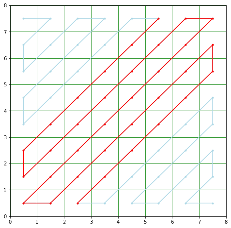
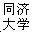
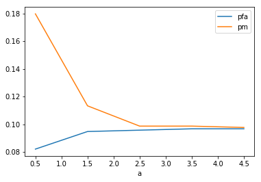
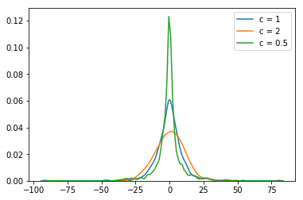
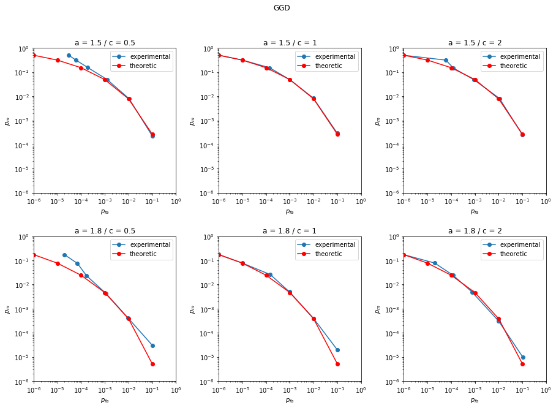

# 实验二 

---

[TOC]

---

## 实验要求

### 图像中隐藏数据

- 在图像的DCT系数上利用加性扩频水印嵌入信息
-  利用线性相关器解码，统计一下总错误率
- 实验一下不同的嵌入强度对作品知觉效果和解码效果的影响，并且绘制实验曲线
- 水印作品受到攻击：大家可以用图像处理软件 等加入噪声、改变对比度、JPEG压缩等攻击， 然后看看解码的效果（实验曲线）

### Monte-Carlo仿真验证ASS水印检测理论

* 无攻击情况下：宿主信号 $\bf X$ 服从期望为 GGD 分布(中心为0，标准偏差 STD = 10)，嵌入强度 $a = 1.8$，$N = 1000$。实验要求达到 的精度 1E-6。
  - 不同形状参数下的性能：绘制ROC曲线（包括 形状参数分别为c = 2.0、1.0、0.5时系统理论 性能和实验性能）
  - 不同嵌入强度下的性能：绘制ROC曲线（强度 a= 1.5, a = 1.8时的理论和实验性能(c = 2.0))
* 受到攻击情况下：宿主信号 $X$ 服从期望为高斯分布(中心为0，标准偏差STD = 10)，嵌入强度 $a = 1.8$，$N = 1000$。实验要求达到 的精度 1E-6。 
  - 噪声期望为0，STD 分别为 2.5、5
  - 绘制此时的 ROC 曲线（未受攻击时的理论性能， 受到攻击时的理论和实验性能)

## 实验环境

| 环境                          |
| ----------------------------- |
| vscode                        |
| windows10                     |
| x86_64-w64-mingw32 + makefile |

## 水印解码与验证

### 前置知识

1. BMP 图片格式[^1]

   - BMP 取自 Bitmap 缩写，是一种不压缩的图片格式。保存的颜色深度的位数指的是每点所用是数据位。原图片中 `Lena.bmp` 的位深度是8，`tj-log0.bmp` 的位深度是1

   - 文件格式：

     
     
     其中 DIB 头部分，目前比较通用的格式为 BITMAPINFOHEADER 版本
     
     
     
     总结一下，格式为：
     
     | 结构名称         | 成员                                                         |
     | ---------------- | ------------------------------------------------------------ |
     | HEADER           | 文件类型  2 Byte<br />BMP大小  4 Byte<br />Reserved1  2 Byte<br />Reserved2  2 Byte<br />offset  4 Byte |
     | BITMAPINFOHEADER | 头结构大小  4 Byte<br />宽度  4 Byte<br />高度  4 Byte<br />色彩平面数  2 Byte<br />像素位数  2 Byte<br />压缩方法  4 Byte<br />图像大小  4 Byte<br />横向分辨率  4 Byte<br />纵向分辨率  4 Byte<br />调色板颜色数  4 Byte<br />重要颜色数  4 Byte |
     | PALETTE          | 调色板包含很多条目，每个条目描述一种颜色 4 Byte<br />条目个数即颜色个数，由像素位数决定 |
     | BITMAP           | 位图中涉及到对齐填充的操作，填充后每行的字节数为 $RowSize = 4\cdot\lceil\frac{BitsPerPixel\cdot Width}{32}\rceil$ |

2. 二维 DCT 变换 [^2]
   变换公式为：
   $$
   F(u,v)=c(u)c(v)\sum_{i=0}^{N-1}\sum_{j=0}^{N-1}f(i,j)\cdot
   \cos[\frac{(2i+1)\pi}{2N}u]\cdot
   \cos[\frac{(2j+1)\pi}{2N}v]\\
   其中\,c(u)=\left\{
   \begin{matrix}
    \sqrt{\frac1N},\quad u=0 \\
    \sqrt{\frac2N},\quad u\neq0
   \end{matrix}
   \right.
   $$
   逆变换公式为：
   $$
   f(i,j)=\sum_{u=0}^{N-1}\sum_{v=0}^{N-1}c(u)\cdot c(v)\cdot F(u,v)\cdot
   \cos[\frac{(2i+1)\pi}{2N}u]\cdot
   \cos[\frac{(2j+1)\pi}{2N}v]\\
   其中\,c(u)=\left\{
   \begin{matrix}
    \sqrt{\frac1N},\quad u=0 \\
    \sqrt{\frac2N},\quad u\neq0
   \end{matrix}
   \right.
   $$

### 加性扩频水印嵌入信息

#### 步骤

嵌入包括如下几个步骤：

1. 将图像的位图分为 $8\times8$ 的小块，可以得到 $M$ 块
2. 对每个小块进行 DCT 变换，按 Zigzag 排序选出 $K$ 个 ***中频系数*** 进行嵌入操作，如果不是中频系数，解码时会出现问题
3. 使用 $N$ 个系数嵌入一位 b，假设需要嵌入 $L$ 位数据，则 $N=\frac{M\times K}L$，即需要选出 $\frac{N}K$ 个块嵌入一个 b，根据输入的嵌入强度，可以得到 $s_i=x_i+b_iaw_i$，然后将 $s_i$ 放回原来 $x_i$ 的位置

水印解码的过程如下：

1. 将图像的位图分为 $8\times8$ 的小块，可以得到 $M$ 块

2. 对每个小块进行 DCT 变换，按 Zigzag 排序选出 $K$ 个 ***中频系数*** 计算和 $sum=x_i\cdot w_i,\quad i=1,\cdots,K$ ，可以得到 $\frac{N}k$ 个这样的 $sum$，计算
   $$
   s_t=\frac{\sum_{i=1}^{\frac{N}k}sum_i}N\\
   
   b_t=\left\{\begin{matrix}
    1,\quad s\gt0 \\
    0,\quad s\lt0
   \end{matrix}
   \right.\\
   t=1,2,\cdots,L
   $$
   
3. 将 $L$ 个 b 恢复为 $L$ 位的位图，嵌入 bmp 图的框架即可

#### 实现

主要的工作分为几个部分：

1. `BMP` 类的编写：这个部分比较繁琐但简单，只需要按照文件格式编写即可

   ```c++
   class BMP {
   public:
       BMP(): m_palette(nullptr), m_bitmap(nullptr) {};
       ~BMP();
       BMP(const BMP&);
       void operator=(const BMP&);
       void operator=(BMP&&);
       BMP(BMP&&);
       void set_bitmap(const BITMAP&, int n);
       BITMAP get_bitmap() const ;
       int get_bitmap_size() const ;
       int get_width() const ;
       int get_height() const ;
       void load_bmp(const string&);
       void write_bmp(const string&);
   #ifdef TEST_BMP
       void output_BYTE();
       void bmp_test();
   #endif
   private:
       void write_BYTE_to(ostream&, BYTE*, int);
       // void read_BYTE_from(const istream&, BYTE*, int);
       int get_row_size() const ;
       int get_padding();
       int get_palette_colors();
   private:
       int m_colors;
       int m_row_size;
       int m_bitmap_size;
       HEADER m_header;
       BITMAPINFOHEADER m_info_header;
       PALETTE m_palette;
       BITMAP m_bitmap;
   };
   ```

   

2. DCT 变换和逆变换：这个部分只需要按照公式编代码即可，以正变换为例
   ```c++
   void DCT(const BLOCK& blk1,BLOCK& blk2) {
       
       for(int u = 0; u < NUM; u++) {
           for(int v = 0; v < NUM; v++) {
               double cu = c(u);
               double cv = c(v);
               double sum(0);
               for(int i = 0; i < NUM; i++) {
                   for(int j = 0; j < NUM; j++) {
                       sum += blk1[i][j] * 
                       cos((2 * i + 1) * PI * u / (2 * NUM)) *
                       cos((2 * j + 1) * PI * v / (2 * NUM)); 
                   }
               }
               blk2[u][v] = cu * cv * sum;
           }
       }
   }
   
   ```

   

3. 系数 $w$ 和 中频系数生成：中频系数的介绍和理解我参考了博客[^3]。我是用 `python` 实现的生成系数的操作，然后将系数作为常数复制到 `cpp` 程序中。`python` 程序在 `lab2-ass.ipynb` 中，生成的中频系数如下图

   
   而 $w$ 系数的生成，可以利用洗牌算法选出 $n$ 个随机数，即

   - 每次抽取一个随机数 $k$
   - 将第 $k$ 位置的数和最后一个数交换
   - 去掉最后一个数
   - 重复上述过程直到去掉了 $n$ 个数

4. 分块：分块的核心是找到该块的一个基准点，比如以每一块中的第 0 行第 0 列作为基准，然后只需要做一个位图到某个块的映射就可以了，核心代码为：
   ```c++
       for(int i = 0; i < width; i += 8) {
           for(int j = 0; j < height; j += 8) {
               if(count == N / K) {
                   count = 0;
                   l++;
               }
               // 分块
               for(int w = 0; w < NUM; w++) {
                   for(int h = 0; h < NUM; h++)  {
                       blk[w][h] = origin_bitmap[width * (i + w) + j + h];
                   }
               }
               //
               // 其他操作
               // ...
               //
               count++;
               // 还原块
               for(int w = 0; w < NUM; w++) {
                   for(int h = 0; h < NUM; h++)  {
                       new_bitmap[width * (i + w) + j + h] = blk[w][h];
                   }
               }
           }
       }
   ```

   

#### 测试效果

在命令行输入 `make` 进行编译，尝试不同的嵌入强度

1. 部分测试数据的视觉效果如下表

   | 嵌入强度 | 嵌入加性水印（缩小到 25%）                                   | 解码（放大到 200%）                                          |
   | -------- | ------------------------------------------------------------ | ------------------------------------------------------------ |
   | $0.5$    |  |  |
   | 1.5      |  |  |
   | 20       |  |  |
   | 100      |  |  |

   从表格中可以看到，随着嵌入强度增强，图像的能见度越差，水印的还原度越高

2. 错误率曲线如下图：
   用 `python` 导入程序生成的性能数据文件，可以画出下面的变化曲线：

   
   从图中可以看到，随着嵌入强度增强，图像的误检率增大，漏检率降低

## 蒙特卡洛仿真

### 蒙特卡洛模拟

#### 生成广义高斯分布

由实验一可知，可以通过一个伯努利分布和一个指数分布来生成广义高斯分布，即可以通过相互独立的随机变量 $W\sim B(1,\frac12)$ 和 $E\sim Gamma(\frac1c,\frac{1}{\beta^c})$ 通过如下方式构造 $X\sim GGD(c,\beta)$
$$
X=\left\lbrace
\begin{matrix}
E^{\frac1c},&\quad if\,\,W=1\\
-E^{\frac1c},&\quad if\,\,W=0
\end{matrix}
\right.
$$

1. 代码实现为：
   ```c++
   double* gdd(double beta, double c, int n, int key) {
       double* res = new double[n];
       bool W;
       double E;
       double tmp;
   #ifdef DEBUG
       std::stringstream ss;
       static int counts = 0;
       ss << "../build/gdd" << counts << "_beta" << beta << "_c" << c << ".txt";
       std::string path = ss.str();
       std::ofstream out(path, std::ios::out);
       if(!out)
           std::cout << "fail opening file" << std::endl;
   #endif
       std::mt19937_64 engine(key);
       std::bernoulli_distribution bern(0.5);
       std::gamma_distribution<double> gamma(1/c, 1/pow(beta, c));
       for(int i = 0; i < n; i++) {
           W = bern(engine);
           E = gamma(engine);
           double tmp = pow(E, 1/c);
           res[i] = (W) ? tmp : -tmp;
   #ifdef DEBUG
           out << res[i] << std::endl;
   #endif
       }
       return res;
   }
   ```

2. 利用 `python` 可以将我生成的数据绘制成概率密度图，如下：
   

### 系统性能 

#### 理论推导

1. $p_{fa}$ 和 $p_m$ 的定义

   给出两个假设 $;H_0:s_i=x_i,H_1:s_i=x_i+aw_i$，可以用线性相关器 $L({\bf S})=\frac1N\sum_{i=1}^NS_i\cdot w_i$ 来进行假设检验函数，可以得到：
   $$
   &L({\bf S}\mid H_0)=\frac1N\sum_{i=1}^NX_i\cdot w_i\\
   &L({\bf S}\mid H_1)=\frac1N\sum_{i=1}^NX_i\cdot w_i+a
   $$
   因此可以利用一个阈值 $\psi$ 来判断是否嵌入水印，即：
   $$
   \left\lbrace
   \begin{matrix}
   L({\bf S})>\psi\Rightarrow H_1\\
   L({\bf S})<\psi\Rightarrow H_0
   \end{matrix}
   \right.
   $$
   定义误检概率为 $p_{fa}=P(H_1\mid H_0)$，漏检概率为 $p_m=P(H_0\mid H_1)$，因此：
   $$
   p_{fa}=P(\frac1N\sum_{i=1}^NX_i\cdot w_i\gt\psi)\\
   p_m=P(\frac1N\sum_{i=1}^NX_i\cdot w_i+a\lt\psi)
   $$
   可以假设 $X_i$ 是独立同分布的，且具有期望 $\mu$ 和标准差 $\sigma_X$，由中心极限定理，可以得到：
   $$
   \underset{N\rightarrow\infty}{\lim}\frac{\sum_{i=1}^NX_i-N\mu}{\sqrt{N}\sigma_x}\rightarrow N(0,1)
   $$
   因此，为了处理 $p_{fm}$ 和 $p_m$，可以记 $\overline{X}=\frac1N\sum_{i=1}^NX_i\cdot w_i$ 

2. 计算 $E(\overline X)$ 和 $Var(\overline X)$ 

   计算 $E(\overline X)$ ：
   $$
   \begin{align}
   E(\overline X)&=E(\frac1N\sum_{i=1}^NX_i\cdot w_i)\\
   &=\frac1NE(\sum_{i\in\lbrace k:w_k=1\rbrace}^NX_i)-\frac1NE(\sum_{i\in\lbrace k:w_k=-1\rbrace}^NX_i)
   \end{align}
   $$
   由于 $\sum_{i=1}^Nw_i=0$，故 $\lvert\lbrace k:w_k=1\rbrace\rvert=\lvert\lbrace k:w_k=-1\rbrace\rvert$ ，则 $E(\overline X)=0$。计算均值 $Var(\overline X)$ 如下：
   $$
   \begin{align}
   Var(\overline X)&=E\big[(\overline{X}-E(\overline{X}))^2\big]\\
   &=E(\overline{X}^2)-E(\overline{X})^2\\
   &=E\big[\frac{1}{N^2}\sum_i\sum_jX_i\cdot X_j\cdot w_i\cdot w_j\big]\\
   &=\frac{1}{N^2}\sum_j\sum_jw_i\cdot w_j\cdot E(X_i\cdot X_j)
   \end{align}
   $$
   由于 $X_i$ 服从独立同分布，则 $E(X_i\cdot X_j)=E(X_i)\cdot E(X_j),i\neq j$，则：
   $$
   \begin{align}
   Var(\overline X)&=\frac{1}{N^2}\sum_j\sum_jw_i\cdot w_j\cdot E(X_i\cdot X_j)\\
   &=\frac{1}{N^2}\bigg[\sum_i\sum_{j\neq i}w_i\cdot w_j\cdot E(X_i)\cdot E(X_j)+\sum_iw_i^2E(X_i^2)\bigg]\\
   &=\frac{1}{N^2}\bigg[\mu^2\sum_iw_i\sum_{j\neq i}w_j+N(\sigma_X^2+E(X_i)^2)\bigg]\\
   &=\frac{\sigma_X^2+\mu^2}{N}
   \end{align}
   $$
   根据 $\overline X$ 的方差和期望，可以方便的计算 $p_{fa}$ 和 $p_m$ 了

3. 计算 $p_{fa}$ 和 $p_m$ 
   由于本次实验服从的分布均值为 0，因此结合中心极限定理，可以知道 $\frac{\overline{X}}{\sigma_X/\sqrt{N}}\sim N(0,1)$ 因此：
   $$
   \begin{align}
   p_m&=P(\overline{X}+a\lt\psi)\\
   &=\Phi(\frac{\sqrt{N}(\psi-a)}{\sigma_X})\\
   &=1-Q(\frac{\sqrt{N}(\psi-a)}{\sigma_X})\\
   p_{fa}&=P(\overline X\gt\psi)\\
   &=Q(\frac{\sqrt{N}\psi}{\sigma_X})
   \end{align}
   $$
   其中 $Q(x)=\int_x^{+\infty}\frac{1}{\sqrt{2\pi}}e^{-\frac{t^2}{2}}{\rm d}t$ 是尾部概率函数，记互补误差函数为 ${\rm erfc}(x)=1-{\rm erf}()x=\frac{2}{\sqrt{\pi}}\int_x^{+\infty}e^{-t^2}{\rm d}t$ 则有：
   $$
   \begin{align}
   Q(\sqrt{2}x)&=\int_{\sqrt{2}x}^{+\infty}\frac{1}{\sqrt{2\pi}}e^{-\frac{s^2}{2}}{\rm d}s\\
   &\xlongequal{s=\sqrt{2}t}\int_x^{+\infty}\frac{1}{\sqrt{\pi}}e^{-t^2}{\rm d}t\\
   &=\frac12{\rm efrc(x)}
   \end{align}
   $$
   因此 $Q(x)=\frac12 {\rm erfc}(\frac{x}{\sqrt{2}})$ ，$Q^{-1}(x)=\sqrt{2}\cdot {\rm erfc}^{-1}(2x)$ 

   

4. 可以利用 $p_{fa}$ 反推 $\psi$ ，即： 
   $$
   \psi=\frac{\sigma_XQ^{-1}(p_{fa})}{\sqrt{N}}=\frac{\sqrt{2}\cdot\sigma_X\cdot {\rm erfc}^{-1}(2p_{fa})}{\sqrt{N}}
   $$
   此时有：
   $$
   p_m=1-Q(\frac{\sqrt{N}(\psi-a)}{\sigma_X})=1-Q(Q^{-1}(p_{fa})-\frac{\sqrt{N}a}{\sigma_X})
   $$
   

#### 仿真结果

首先生成不同的阈值，阈值的生成可以用前面的结论，通过 $p_{fa}$ 进行反推，设置错检概率为：

```c++
const double pfa0[g] = {
    1E-6, 1E-5, 1E-4, 1E-3, 0.01, 0.1, 0.3, 0.5, 0.7, 1
};
```

生成阈值的函数为：

```c++
double threshold(double pfa, double sigma, int n) {
    double res = pow(2, 0.5) * sigma * ierfc(2 * pfa);
    return res / pow(n, 0.5);
}
```

为了方便画图，对生成的性能文件进行如下规定：

```shell
delimiter = "_"
prefix = "../build/performance" + delimiter
suffix = ".txt"

file_name = prefix + 
			distribution_name + delimiter +
			"a" + a_val + delimiter +
			"c" + c_val + 
			suffix
```

`python` 脚本根据上述文件命名规则，可以很容易输出多组 ROC 图

1. 无噪声情形：宿主信号服从 $GGD$ 分布
   根据理论分析中线性分析器的判断准则，可以写出如下测试程序

   ```c++
   for (int i = 0; i < 2; i++) {
           for (int j = 0; j < 3; j++) {
               ss.str("");
               ss << prefix << "GGD_a" << a[i] << "_";
               // 清空数组
               for(int k = 0; k < g; k++) {
                   fa[k] = 0;
                   m[k] = 0;
               }
               // 生成对应的性能文件
               ss << "c" << c[j] << suffix;
               std::ofstream out(ss.str(), std::ios::out);
               if(!out)
                   std::cout << "fail opening file, file = " << ss.str() << std::endl;
               for (int k = 0; k < NUM; k++) {
                   // 生成服从 gdd 分布的序列，长度为 N
                   key = rd(engine);
                   x = gdd(get_beta(c[j], STD), c[j], N, key);
                   // 嵌入水印
                   s = embed(x, w, a[i], N);
                   LS_origin = L(x, w, N);
                   LS_embeded = L(s, w, N);
                   // 计算性能
                   performance(LS_origin, psi, fa, m, g, N, true);
                   performance(LS_embeded, psi, fa, m, g, N, false);
               }
               
               for (int k = 0; k < g; k++) {
                   pfa[k] = double(fa[k]) / double(NUM);
                   pm[k] = double(m[k]) / double(NUM);
                   out << pfa[k] << " " << pm[k] << "\n";
               }
               // 
               delete x;
               delete s;
           }
       }
   ```

2. 噪声信号服从 $N(0,100)$ 

   有噪声信号时，最终要测试的数据变为了 $Y=S+V=a+w\cdot X+V$，如果采用和无噪声情形一样的阈值，那么计算理论数据时，只需要将分母上的标准差改为 $\sigma=\sqrt{\sigma_X^2+\sigma_N^2}=10\sqrt{2}$，其余和无噪声情形相同。蒙特卡洛模拟的代码和无噪声情形类似，为了统一，只需要将嵌入函数加上一个是否有噪声即可，代码如下：

   ```c++
       for (int j = 0; j < 3; j++) {
           ss.str("");
           ss << prefix << "Gauss_a" << a[1] << "_";
           // 清空数组
           for(int k = 0; k < g; k++) {
               fa[k] = 0;
               m[k] = 0;
           }
           // 生成对应的性能文件
           ss << "c" << c[j] << suffix;
           std::ofstream out(ss.str(), std::ios::out);
           if(!out)
               std::cout << "fail opening file, file = " << ss.str() << std::endl;
           for (int k = 0; k < NUM; k++) {
               // 生成服从 gdd 分布的序列，长度为 N
               key = rd(engine);
               x = gdd(get_beta(c[j], STD), c[j], N, key);
               v = gauss(0, 10, N, key);
               // 嵌入水印
               s = embed(x, w, a[1], N, true, v);
               LS_origin = L(x, w, N);
               LS_embeded = L(s, w, N);
               // 计算性能
               performance(LS_origin, psi, fa, m, g, N, true);
               performance(LS_embeded, psi, fa, m, g, N, false);
           }
           
           for (int k = 0; k < g; k++) {
               pfa[k] = double(fa[k]) / double(NUM);
               pm[k] = double(m[k]) / double(NUM);
               out << pfa[k] << " " << pm[k] << "\n";
           }
           // 
           delete x;
           delete s;
           delete v;
       }
   ```

3. ROC 曲线图
   由于算力有限，最终只跑了 `1E-5` 的精度，部分等于 0 的数据加了一个微小的偏移量，图像如下：

   - 不带噪声的

     

   - 带噪声的
     

   可以从图中看出，用线性分析器的验证方法是正确的


[^1]:[BMP format -Wiki](https://zh.wikipedia.org/wiki/BMP)
[^2]:[二维DCT变换 - 腾讯云开发者社区-腾讯云 (tencent.com)](https://cloud.tencent.com/developer/article/1386017)
[^3]:[(286条消息) 基于修改DCT中频系数的JPEG数字水印_IKHIN的博客-CSDN博客_中频系数](https://blog.csdn.net/qq_26140297/article/details/79945052)

